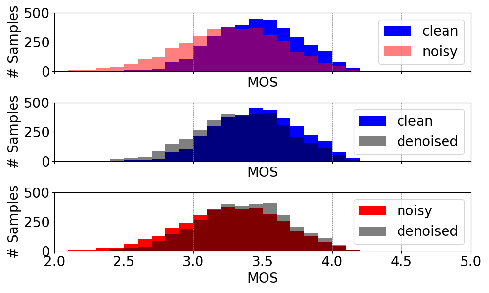

Audio Denoising using Generative Adversarial Networks
=====================================================

This repository contains PyTorch implementation of GAN approach to denosing.


## Installation

### Requirements

The model is implemented in Python 3.11.0 and uses several additional libraries which can be found in
environments.yaml


### Setup

To install this package, simply clone the git repo:

```
git clone ...
cd adversarial-denoising
conda env create -f environment.yaml
conda activate audio-enh-supervise
```

## Running the model

### Contents

The repository is structured as follows.

* `./src`: model source code
* `./data`: code to download the model data

### Retrieving data

The `./data` subfolder contains code for preparing the VCTK speech dataset with 
clean and noisy samples. VCTK dataset can be downloaded and unpacked by running
```
cd ./data/vctk
make
```
DEMAND noise dataset can be dowloaded by running 
```
cd ./data/noise
python load_dataset.py
```

Next, you must prepare the dataset for training:
you will need to create pairs of high and low resolution sound patches (typically, about 0.5s in length).
I have included a script called `prep_vctk_short.py` that does that. 

The output of the data preparation step are two `.h5` archives containing, respectively, the training and validation pairs of clean/noisy sound patches.
You can also generate these by running `make` in the corresponding directory, e.g.
```
cd ./data/vctk/multispeaker
make
```

The key parameters of datasets are the sampling rate SR (e.g. to 16000 or 48000) in the `/multispeaker/Makefile` file.


### Audio denoising tasks


### Training the model

Running supervised model is handled by the `src/run_supervised.py` script.
This script is launched as 

```
cd ./src:
make run_training;
```

Running GAN models is handled by the `src/run_gan.py` script.
This script is launched as 

```
cd ./src
make run_training_gan_16_r_4_multispeaker
```

Here are examples of training curves in terms of signal-to noise ratio (SNR), log spectral distance (LSD) 
and adversarial loss:


### Testing models

#### Evaluation scores

Trained models files should be put in folder `src/logs/multispeaker/`. 
Evaluation is done along the lines of [Deep Noise Suppression Challenge (ICASSP 2023)]
(https://www.microsoft.com/en-us/research/academic-program/deep-noise-suppression-challenge-icassp-2023/)
[DNSMOSP.835](https://arxiv.org/pdf/2110.01763) model for predicting mean opinion score MOS, 
speech quality SIG, background noise quality BAK, overall speecj quality OVRL.
To calculate this scores run from `/src`

```
cd ./src:
make run_evaluation_scores;
```

Here are spectrograms for these scores obtained using VCTK validation set:



#### Denoising examples

To denoise your own samples put them in folder `/examples` and run

```
cd ./src
make run_evaluation_samples
```

Denoising samples taken from noisy speech dataset [NOIZEUS](https://ecs.utdallas.edu/loizou/speech/noizeus/)

| **Category**       | **Noisy**                                                                                 | **Denoised**                                                                                              | **Car Noise**                                                                    |
|--------------------|-------------------------------------------------------------------------------------------|-----------------------------------------------------------------------------------------------------------|----------------------------------------------------------------------------------|
| **Car**            | <audio controls><source src="examples/sp01_car_sn10.wav" type="audio/wav"></audio>        | <audio controls><source src="examples/Denoised/sp01_car_sn10.pr.wav.wav" type="audio/wav"></audio>        | <audio controls><source src="examples/sp01_car_sn10.wav" type="audio/wav"></audio>  |
| **Restaurant**     | <audio controls><source src="examples/sp01_restaurant_sn10.wav" type="audio/wav"></audio> | <audio controls><source src="examples/Denoised/sp01_restaurant_sn10.pr.wav.wav" type="audio/wav"></audio> | <audio controls><source src="examples/sp01_car_sn10.pr.wav.wav" type="audio/wav"></audio> |
| **Babble**         | <audio controls><source src="examples/sp01_babble_sn10.wav" type="audio/wav"></audio>     | <audio controls><source src="examples/Denoised/sp01_babble_sn10.pr.wav.wav" type="audio/wav"></audio>     | <audio controls><source src="examples/sp01_car_sn10.pr.wav.wav" type="audio/wav"></audio> |
| **Street**         | <audio controls><source src="examples/sp01_street_sn10.wav" type="audio/wav"></audio>     | <audio controls><source src="examples/Denoised/sp01_street_sn10.pr.wav.wav" type="audio/wav"></audio>     | <audio controls><source src="examples/sp01_car_sn10.pr.wav.wav" type="audio/wav"></audio> |
| **Very old audio** | <audio controls><source src="examples/vl.mp3" type="audio/wav"></audio>                   | <audio controls><source src="examples/Denoised/vl.pr.wav.wav" type="audio/wav"></audio>                   | <audio controls><source src="examples/sp01_car_sn10.pr.wav.wav" type="audio/wav"></audio> |

